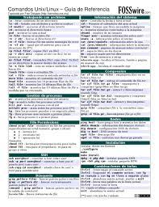

# First_Repository_JCRF
My first repository and first time using

## Second section

First time using git 
- Markdown cheat sheet: https://www.markdownguide.org/cheat-sheet
- Markdown and Latex: https://ashki23.github.io/markdown-latex.html


## Unix commands

- **ls**: list the conten of a directory
- **cd**: change to another directory
- **ls --help**: bucar manual del comando deseado
- **pdw**: print the printing working direcotry. Show where I am at the moment 
- **CNTRL + L**: Cleans the console
- **~** Leads you to your home directory
- **ssh-keygen -t ed25519 -C**: sets a password for the console
- **mkdir**: Creates a new directory



## Git comands
- **git clone**: download a repository in the local machine
```bash
git clone <url>
```
- **git statuts**: check teh current status of the local repository¿
```bash
git status 
```
- **git add**: add files to the staging area before comiting
```bash
git add <file>
```
- **git commit**: register the changes into the history of the repository
```bash
git commit -m "Update README.md"
```
- **git push**: send local changes to github
```bash
git push original main
```
- **git config -global**: sets a user and a password for git
- **cat .gotconfig**: Show the settings of git
- **git log**: history of the changes in a file

